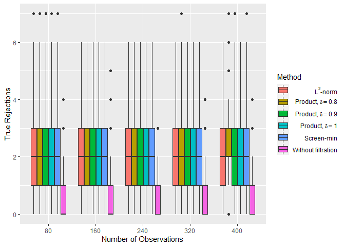
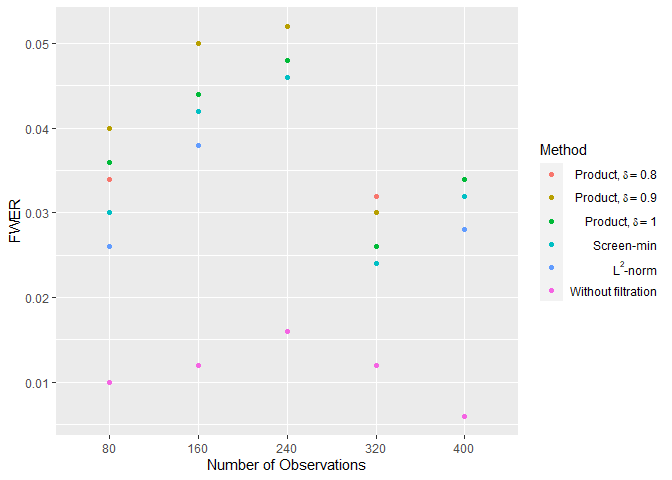
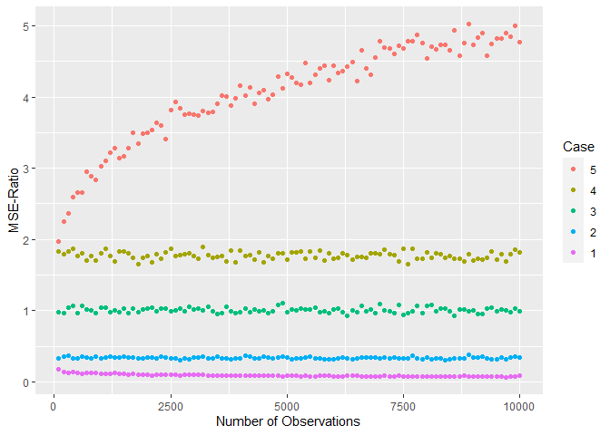

<!-- README.md is generated from README.Rmd. Please edit that file -->

# twostageshrink

<!-- badges: start -->

<!-- badges: end -->

This package is intended to provide the data used to produce the figures
in my MSc thesis, and generic functions which can be used to generate
similar figures, produced with possibly different parameters.

## Installation

<!--
You can install the released version of twostageshrink from [CRAN](https://CRAN.R-project.org) with:

``` r
install.packages("twostageshrink")
```

And the development version from [GitHub](https://github.com/) with:

``` r
# install.packages("devtools")
devtools::install_github("yotamleibovici/twostageshrink")
```
-->

## Example

In order to reproduce the figures of the different two-stage methods’
characteristics appearing in the thesis (their FWER and their number of
true rejections), the following code should be used:

``` r
library(twostageshrink)
#> 
#> Attaching package: 'twostageshrink'
#> The following object is masked from 'package:stats':
#> 
#>     simulate

# Prints the plot comparing the true rejections number of
# the different methods, under the 1st configuration:
reproduce(1, "trej")
```



``` r

# Prints the plot comparing the FWER of
# the different methods, under the 2nd configuration:
reproduce(2, "fwer")
```



``` r

# Prints the plot of the different MSE-ratio for
# different cases, under the 1st configuration:
shrink_reproduce(1)
```



The above lines demonstrate the main usage of this package. The 
function uses the data in the  directory, which is generated with
scripts that can be found in the  directory. However, if you wish to
produce variants of these figures with changes in parameters, you can
use it similarly to the scripts. The function that might help you are ,
,  and , in this order. For the shrinkage figures, the relevant
functions to generate data and manipulate it similarly to the shown in
the thesis are , ,  and , in this order.

Usage example for user-defined parameters for the two-stage figures:

``` r
simulate(
    nobs = seq(from = 10, to = 50, by = 10),
    nexper = 30,
    nhyp = 30,
    config = tibble::tribble(
        ~altr, ~gaddend, ~gfactor, ~gexp, ~baddend, ~bfactor, ~bexp, ~prop,
        FALSE, 0, 0,   0, 0, 0,   0, 0.5,
        FALSE, 0, 3, 3/4, 0, 0,   0, 0.0,
        FALSE, 0, 3, 1/2, 0, 0,   0, 0.4,
        FALSE, 0, 3, 1/3, 0, 0,   0, 0.0,
        FALSE, 1, 3, 1/2, 0, 0,   0, 0.0,
        TRUE,  0, 3, 1/2, 0, 3, 1/2, 0.1,
        TRUE,  0, 3, 1/3, 0, 3, 1/2, 0.0,
        TRUE,  1, 3, 1/2, 0, 3, 1/2, 0.0
    )
) %>%
  
    perform(
        filt_test = pmin(gpval, bpval) < 0.001,
        base_pval = pmax(gpval, bpval),
        base_thrl = 0.1,
        base_thrl_adj_method = function(thrl) { thrl / sum(!is.na(thrl)) },
        nobs, exper
    ) %>%
  
    evaluate(nobs, exper) %>%
  
    measure(nobs)
#> # A tibble: 5 x 2
#>    nobs   fwer
#>   <dbl>  <dbl>
#> 1    10 0.0333
#> 2    20 0.0333
#> 3    30 0.0667
#> 4    40 0.1   
#> 5    50 0.0333
```

Usage example for user-defined parameters for the MSE-ratio figures:

``` r
  shrink_simulate(
    nobs = seq(from = 10, to = 50, by = 10),
    nrep = 30,
    config = tibble::tribble(
      ~gexp, ~gfactor, ~bexp, ~bfactor,
      0.5, 1, 0.6, 1,
      0.5, 1, 0.5, 1,
      0.5, 2, 0.5, sqrt(5/3),
      0.5, 2, 0.5, 2,
      0.4, 2, 0.4, 1
    )
  ) %>%

    shrink_estimate(
      filtexp = 0.7, filtfactor = 1,
      estim_base = gestim*bestim, estim_filt = abs(gestim*bestim)
    ) %>%

    shrink_evaluate(nobs, case)
#> # A tibble: 25 x 5
#>     nobs  case mse_base mse_comp mse_ratio
#>    <dbl> <int>    <dbl>    <dbl>     <dbl>
#>  1    10     1  0.0136   0.0109      0.800
#>  2    10     2  0.0294   0.0272      0.925
#>  3    10     3  0.0660   0.0773      1.17 
#>  4    10     4  0.0579   0.0679      1.17 
#>  5    10     5  0.0786   0.0871      1.11 
#>  6    20     1  0.00575  0.00493     0.857
#>  7    20     2  0.00353  0.00361     1.02 
#>  8    20     3  0.0203   0.0233      1.15 
#>  9    20     4  0.0185   0.0230      1.25 
#> 10    20     5  0.0185   0.0200      1.08 
#> # ... with 15 more rows
```

<!--
What is special about using `README.Rmd` instead of just `README.md`? You can include R chunks like so:


```r
summary(cars)
#>      speed           dist       
#>  Min.   : 4.0   Min.   :  2.00  
#>  1st Qu.:12.0   1st Qu.: 26.00  
#>  Median :15.0   Median : 36.00  
#>  Mean   :15.4   Mean   : 42.98  
#>  3rd Qu.:19.0   3rd Qu.: 56.00  
#>  Max.   :25.0   Max.   :120.00
```

You'll still need to render `README.Rmd` regularly, to keep `README.md` up-to-date.

You can also embed plots, for example:


In that case, don't forget to commit and push the resulting figure files, so they display on GitHub!
-->
